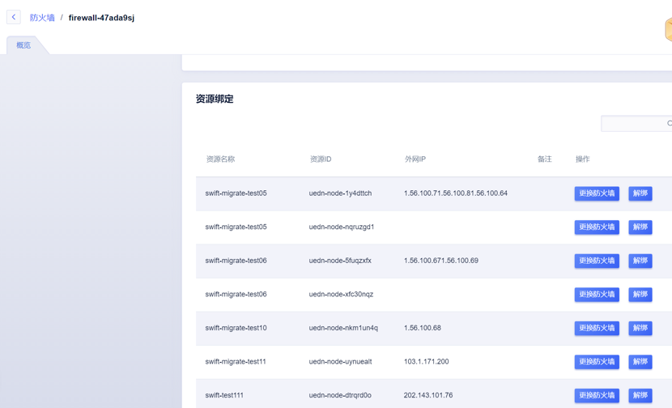

## 外网防火墙

外网防火墙支持对主机的外网ip进行保护，支持在创建一个防火墙规则后，批量应用到多台虚拟机。

#### 创建防火墙

指定防火墙的名称，并配置相应的规则后，即可创建防火墙规则。

​                               

 

#### 防火墙绑定解绑

在防火墙列表界面，点击单个防火墙后的详情按钮，进入防火墙管理界面。可对当前防火墙绑定的主机进行修改，支持更换防火墙，或者解绑。该操作可在主机运行时动态操作，不需停止虚拟机。

